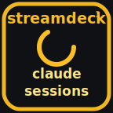
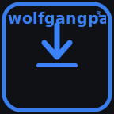
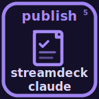
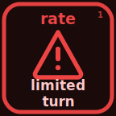
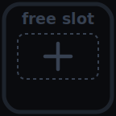

# streamdeck-claude

> A Stream Deck plugin that mirrors live [Claude Code](https://github.com/anthropics/claude-code) CLI session state on as many keys as you assign it.

[](LICENSE)
[](#compatibility)
[](https://nodejs.org)
[](https://www.elgato.com/stream-deck)

Each running `claude` CLI session lights up one key on your deck — project name, current state, animated when it's working, pulsing when it needs you. Press a key to copy the session's `cwd` to your clipboard and (on macOS / Windows) jump straight to the matching [Warp](https://www.warp.dev) tab.

## State gallery

| | State | Meaning |
|---|---|---|
|  | `working` | Claude is generating / running tools |
|  | `subagent` | Claude has delegated to a subagent (parent waiting) |
|  | `idle` | Claude is waiting for your next prompt |
|  | `awaiting` | Permission prompt — your turn |
|  | `awaiting_plan` | `ExitPlanMode` was called — plan approval pending |
|  | `error` | Last turn failed (rate limit / auth / server error) |
|  | `finished` | Session just ended (visible ~3 s, then drops) |
|  | `empty` | No session in this slot |

## Features

- **Live per-session state** — sessions auto-fill the slots in start-time order; excess sessions beyond the slot count are simply not displayed.
- **Press → copy `cwd`** to clipboard.
- **Press → focus matching Warp tab** (macOS + Windows). See [`docs/warp-focus.md`](docs/warp-focus.md).
- **Long-press (≥500 ms) → reset that session's state log** — useful if a stuck `awaiting` lingers.
- **Setup key** — wipes all event logs and re-renders every slot in one press.

## Compatibility

| | Support |
|---|---|
| **Stream Deck app** | macOS 12+, Windows 10+ (Stream Deck app ≥ 6.5) |
| **Claude CLI host** | macOS, Linux, WSL, Windows-native — sessions on any of these show up |
| **Stream Deck app on Linux** | Not supported — Elgato doesn't ship a Linux app |
| **Node.js** | ≥ 20 (bundled into the plugin runtime by the Stream Deck app) |
| **Terminal integration** | Warp tab focus on macOS + Windows; clipboard copy works with any terminal |

## Install

Prereqs everywhere: [pnpm](https://pnpm.io), `jq`, `perl`, Node.js 20+, an Elgato Stream Deck with the SD app installed.

### macOS

```bash
pnpm install
pnpm build
pnpm install:hook        # add hooks to ~/.claude/settings.json
pnpm sd:link             # symlink .sdPlugin into ~/Library/Application Support/com.elgato.StreamDeck/Plugins/
pnpm sd:validate
# Quit + relaunch the Stream Deck app so it picks up the new plugin.
```

For Warp tab focus, macOS will prompt to allow Stream Deck under *System Settings → Privacy & Security → Accessibility* on the first key press. Decline and the focus is silently skipped — clipboard copy still works.

### WSL + Windows

Extra prereq: Windows Developer Mode enabled (so `mklink /D` works without admin).

```bash
pnpm install
pnpm sd:dev                   # enable Stream Deck developer mode (one-time)
pnpm build
pnpm install:hook             # WSL ~/.claude/settings.json
pnpm install:hook:windows     # Windows %USERPROFILE%\.claude\settings.json
pnpm sd:link                  # mklink /D into the Windows-side Plugins dir
pnpm sd:validate
```

`WSL_DISTRO_NAME` is auto-detected and baked into the bundle at build time. To target a different distro, set it in your shell before `pnpm build`.

For Warp tab focus on Windows, install `sqlite3` if you don't have it: `winget install SQLite.SQLite`.

After linking, **quit + relaunch the Stream Deck app** (right-click tray icon → Quit). The "Claude Sessions" category appears in the action list.

## Usage

Drag **Claude Session Slot** onto as many keys as you want to dedicate to live sessions. The plugin orders them by deck position (top-to-bottom, left-to-right). Optionally, drag the **Claude Setup** action onto one more key as a maintenance button.

Run `claude` in a terminal — the first slot fills with the project name, amber while working, blue when idle. Open `claude` in another `cwd` and slot 2 lights up.

## Development

```bash
pnpm watch                    # rebuild + auto-reload the plugin on each change
pnpm sd:reload                # touch the reload trigger to respawn the plugin (~1 s)
```

Logs land at `%APPDATA%\Elgato\StreamDeck\Plugins\com.julien.claudesessions.sdPlugin\logs\` (Windows) or `~/Library/Logs/ElgatoStreamDeck/com.julien.claudesessions.sdPlugin/` (macOS). Full script reference and verification checklist in [`docs/development.md`](docs/development.md).

## Documentation

- [`docs/architecture.md`](docs/architecture.md) — session discovery, hook event → state machine, path/UNC resolution, render pipeline
- [`docs/development.md`](docs/development.md) — full pnpm scripts, end-to-end verification, tweaks
- [`docs/warp-focus.md`](docs/warp-focus.md) — Warp focus internals, per-OS quirks, failure modes

## License

Code is MIT — see [`LICENSE`](LICENSE).

The Clawd mascot used in the `idle` state — `assets/clawd/*.svg` and the renderer at `src/icons/motifs.ts::clawdIdleLook` — is derived from [rullerzhou-afk/clawd-on-desk](https://github.com/rullerzhou-afk/clawd-on-desk) and is licensed under **AGPL-3.0**. See [`com.julien.claudesessions.sdPlugin/assets/clawd/NOTICE.md`](com.julien.claudesessions.sdPlugin/assets/clawd/NOTICE.md) for the full attribution.
